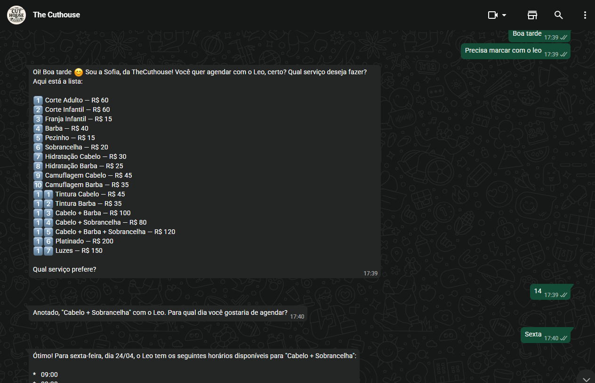

# 🤖 Cuthouse WhatsApp Bot

Bot de agendamento inteligente para barbearia via WhatsApp com IA conversacional.
Desenvolvido para a **The Cuthouse** — em produção com cliente real.

---

## 💡 Como funciona

1. Cliente envia mensagem no WhatsApp
2. Bot identifica a intenção (agendar, cancelar, consultar horários)
3. IA (Gemini) processa e responde em linguagem natural
4. Sistema consulta disponibilidade em tempo real via Cal.com
5. Agendamento confirmado automaticamente no Supabase

---

## 🛠️ Stack utilizada

- **n8n** — orquestração dos fluxos de automação
- **Evolution API** — integração com WhatsApp
- **Google Gemini AI** — processamento de linguagem natural
- **Cal.com** — gestão de agendamentos
- **Supabase** — banco de dados e histórico de conversas
- **Redis** — controle de sessão e debounce de mensagens

---

## 📁 Arquivos

| Arquivo | Descrição |
|---|---|
| `Cuthouse.json` | Fluxo principal do bot no n8n |
| `Cuthouse- Lembrete Ag Fernando.json` | Fluxo de lembrete automático de agendamento |

> Para usar: importe os arquivos `.json` diretamente no seu n8n via
> **Menu → Import workflow**

---

## 📸 Demonstração

---

## 👨‍💻 Desenvolvido por

[Pedro Massi](https://github.com/pedromazzi) — Especialista em Automação & AI Agents
